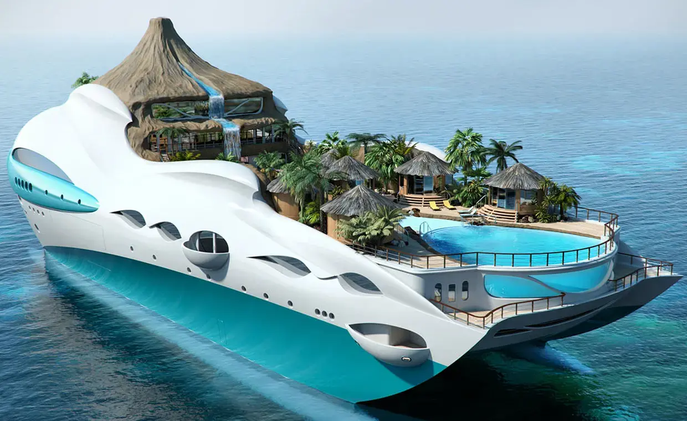
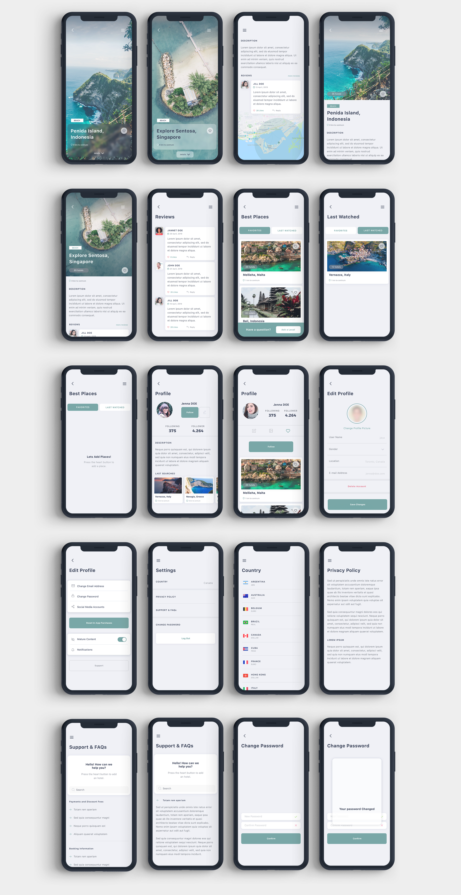

# Un long voyage se dessine devant vous

⛵Bienvenue à bord ! Une nouvelle aventure commence aujourd’hui. Un long voyage se dessine devant vous 🦜.

🧨 Votre mission, si vous l’acceptez (vous n’avez pas le choix en fait ahahah),

👉 En duo, à vous de chercher votre binôme 😁 (et pas toujours les mêmes !), vous allez découvrir l’outil de maquettage **FIGMA**, un **outil COLLABORATIF** pour le design d’interface. Vous allez découvrir la puissance de cette outil a travers une première ressource que je vous partage (une vidéo de prise en main de 40 mins environ).

👉 Ensuite l’objectif est de reproduire par équipe, 6 screens **minimum** au choix parmi la planche design donnée.

Je vous souhaite bonne escale, vous avez 2 jours pour cette mission ! 😜

## Ressources

[vidéo de présentation - 36 minutes & 59 secondes](https://grafikart.fr/tutoriels/figma-presentation-1203)

[Unsplash - images libres de droit](https://unsplash.com/)

[Pexels - images libres de droit](https://www.pexels.com/fr-fr/)

[Flaticon](https://www.flaticon.com/)

Planche Design

